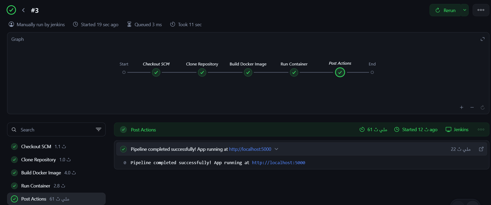
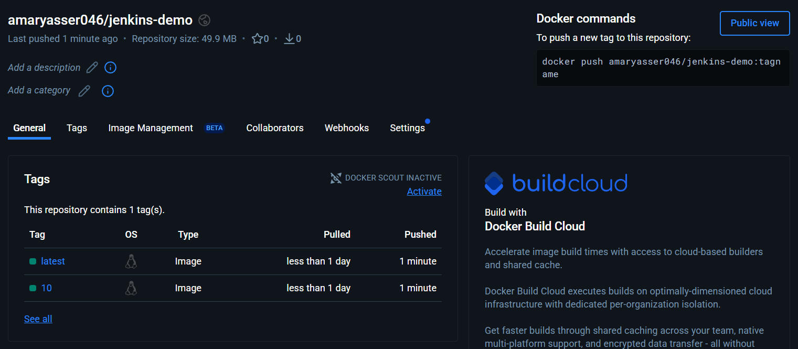

# Jenkins CI Demo Project

This project demonstrates a basic Jenkins CI pipeline for a Dockerized Flask application.

## Project Structure

```
jenkins-demo/
├── app.py           # Flask application
├── test_app.py      # Automated tests (pytest)
├── requirements.txt # Python dependencies
├── Dockerfile       # Docker image configuration
├── Jenkinsfile      # Jenkins pipeline definition
└── README.md        # This file
```

## Pipeline Stages

1. **Clone Repository** - Pull source code from GitHub
2. **Run Tests** - Install dependencies and run automated tests with pytest
3. **Build Docker Image** - Build the Docker image with build number tag (only if tests pass)
4. **Push to Docker Hub** - Push image to Docker Hub with version tag and latest tag
5. **Run Container** - Stop any existing container and run the new one

## Technologies

- **Jenkins** - CI/CD automation server
- **Docker** - Containerization platform
- **GitHub** - Source code repository
- **Python (Flask)** - Web application framework

## Local Testing

Before pushing to Jenkins, you can test locally:

```bash
# Build the Docker image
docker build -t jenkins-demo .

# Run the container
docker run -p 5000:5000 jenkins-demo

# Access the app at http://localhost:5000
```

## Jenkins Setup

### Prerequisites

1. Jenkins installed and running
2. Docker installed on Jenkins server
3. Jenkins user added to docker group:
   ```bash
   sudo usermod -aG docker jenkins
   sudo systemctl restart jenkins
   ```

### Creating the Pipeline Job

1. Open Jenkins → **New Item**
2. Enter name: `jenkins-demo`
3. Select **Pipeline** → OK
4. In Pipeline section:
   - Definition: **Pipeline script from SCM**
   - SCM: **Git**
   - Repository URL: `https://github.com/<your-username>/jenkins-demo.git`
   - Branch: `*/main`
   - Script Path: `Jenkinsfile`
5. **Save** → **Build Now**

### Setting Up Docker Hub Credentials

To push images to Docker Hub, you need to add your credentials to Jenkins:

1. Go to **Jenkins** → **Manage Jenkins** → **Credentials**
2. Click on **(global)** domain
3. Click **Add Credentials**
4. Fill in:
   - Kind: **Username with password**
   - Username: Your Docker Hub username
   - Password: Your Docker Hub password or access token
   - ID: `dockerhub-credentials`
   - Description: Docker Hub credentials
5. Click **Create**

**Important:** Update the `DOCKERHUB_REPO` variable in the Jenkinsfile with your Docker Hub username:
```groovy
DOCKERHUB_REPO = 'your-dockerhub-username/jenkins-demo'
```

## Result

After a successful build:
- Docker image is created with tag `jenkins-demo:<build-number>`
- Image is pushed to Docker Hub with version and `latest` tags
- Container runs on port 5000
- Application accessible at `http://<server-ip>:5000`

### Pipeline Execution Screenshot



*The screenshot above shows a successful Jenkins pipeline execution (Build #3) with all stages completed:*

| Stage | Duration | Status |
|-------|----------|--------|
| Checkout SCM | 1.1s | ✅ Success |
| Clone Repository | 1.0s | ✅ Success |
| Run Tests | - | ✅ Success |
| Build Docker Image | 4.0s | ✅ Success |
| Push to Docker Hub | - | ✅ Success |
| Run Container | 2.8s | ✅ Success |
| Post Actions | 61ms | ✅ Success |

**Total Build Time:** 11 seconds

The pipeline successfully deployed the Flask application, now running at `http://localhost:5000`

### Docker Hub Repository



*The screenshot above shows the Docker Hub repository with pushed images:*

| Tag | Type | Pushed |
|-----|------|--------|
| latest | Image | ✅ Pushed |
| 10 | Image | ✅ Pushed |

Images are available at: `docker pull amaryasser046/jenkins-demo:latest`

## Future Enhancements

- [ ] Add GitHub Webhooks for automatic builds
- [x] Add automated tests stage ✅
- [x] Push images to Docker Hub ✅
- [ ] Deploy to Kubernetes

## Author

Junior DevOps Engineer - Jenkins CI/CD Demo Project

