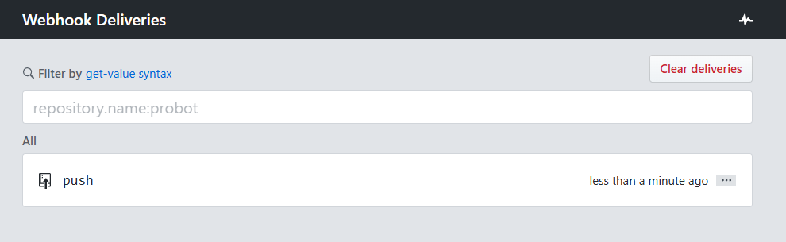
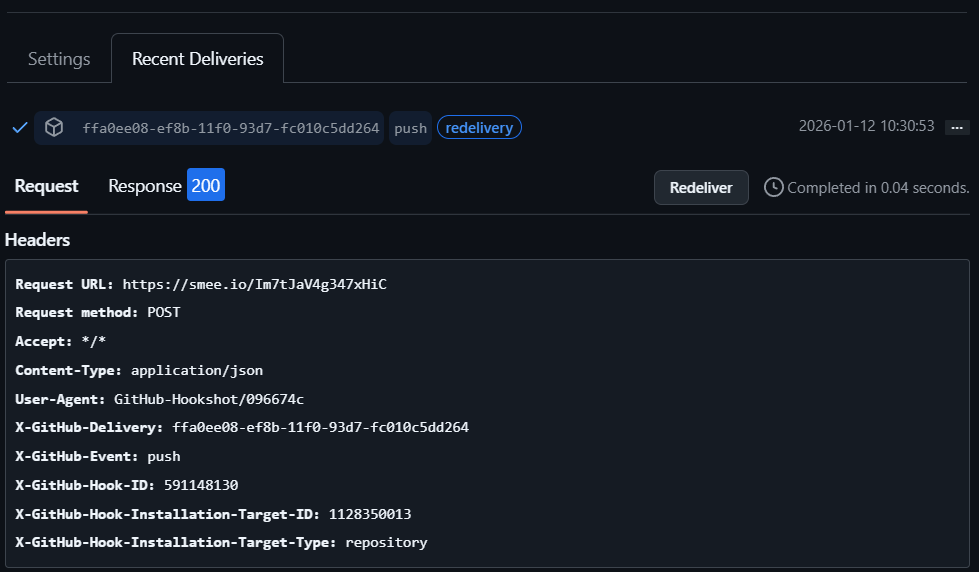

# Jenkins CI Demo Project

This project demonstrates a basic Jenkins CI pipeline for a Dockerized Flask application with **GitHub Webhook integration** for automatic build triggers.

## Project Structure

```
jenkins-demo/
├── app.py           # Flask application with GitHub webhook endpoint
├── test_app.py      # Automated tests (pytest)
├── requirements.txt # Python dependencies
├── Dockerfile       # Docker image configuration
├── Jenkinsfile      # Jenkins pipeline definition
└── README.md        # This file
```

## Pipeline Stages

1. **Clone Repository** - Pull source code from GitHub
2. **Run Tests** - Install dependencies and run automated tests with pytest
3. **Build Docker Image** - Build the Docker image with build number tag (only if tests pass)
4. **Push to Docker Hub** - Push image to Docker Hub with version tag and latest tag
5. **Run Container** - Stop any existing container and run the new one

## Technologies

- **Jenkins** - CI/CD automation server
- **Docker** - Containerization platform
- **GitHub** - Source code repository
- **Python (Flask)** - Web application framework
- **Smee.io** - Webhook payload delivery service

---

## GitHub Webhook Integration

This project includes a webhook endpoint that receives events from GitHub (push, pull request, etc.) and can trigger automated actions like Jenkins builds.

### How It Works

```
┌─────────────┐     ┌─────────────┐     ┌─────────────┐     ┌─────────────┐
│   GitHub    │────▶│  Smee.io    │────▶│ Smee Client │────▶│ Flask App   │
│  (webhook)  │     │  (proxy)    │     │  (local)    │     │ /github-webhook │
└─────────────┘     └─────────────┘     └─────────────┘     └─────────────┘
```

1. **GitHub** sends webhook events (push, PR, etc.) to a public URL
2. **Smee.io** receives the webhook and forwards it to your local smee client
3. **Smee Client** running locally forwards the payload to your Flask app
4. **Flask App** processes the event at `/github-webhook` endpoint

### Webhook Endpoint Features

The `/github-webhook` endpoint in `app.py` handles:

| Event Type | Description |
|------------|-------------|
| `ping` | Sent when webhook is first created (verification) |
| `push` | Triggered when code is pushed to the repository |
| `pull_request` | Triggered on PR open, close, merge, etc. |

### Setting Up the Webhook

#### Prerequisites

- Python 3.x installed
- Node.js installed (for smee-client)
- A GitHub repository

#### Step 1: Install Smee Client

```bash
npm install -g smee-client
```

#### Step 2: Create a Smee Channel

1. Go to [https://smee.io/](https://smee.io/)
2. Click **"Start a new channel"**
3. Copy your unique Smee URL (e.g., `https://smee.io/Im7tJaV4g347xHiC`)

#### Step 3: Run the Flask Application

```bash
cd jenkins-demo
pip install -r requirements.txt
python app.py
```

The app will start on `http://localhost:5000`

#### Step 4: Start Smee Client

In a new terminal, run:

```bash
smee --url https://smee.io/YOUR_CHANNEL_ID --target http://localhost:5000/github-webhook
```

Replace `YOUR_CHANNEL_ID` with your actual Smee channel URL.

#### Step 5: Configure GitHub Webhook

1. Go to your GitHub repository
2. Navigate to **Settings** → **Webhooks** → **Add webhook**
3. Configure the webhook:

| Setting | Value |
|---------|-------|
| **Payload URL** | `https://smee.io/YOUR_CHANNEL_ID` |
| **Content type** | `application/json` |
| **Secret** | (leave empty or set your secret) |
| **Events** | Select "Just the push event" or customize |
| **Active** | ✅ Checked |

4. Click **Add webhook**

GitHub will send a `ping` event to verify the connection. You should see:

```
==================================================
GitHub Event: ping
Delivery ID: xxxxxxxx-xxxx-xxxx-xxxx-xxxxxxxxxxxx
Ping received! Webhook is configured correctly.
==================================================
```

### Testing the Webhook

Make a commit and push to your repository:

```bash
git add .
git commit -m "Test webhook"
git push
```

You'll see output like:

```
==================================================
GitHub Event: push
Delivery ID: xxxxxxxx-xxxx-xxxx-xxxx-xxxxxxxxxxxx
Repository: username/jenkins-demo
Branch: main
Pushed by: username
Commits: 1
  - abc1234: Test webhook
==================================================
```

### Webhook Delivery Screenshots

#### GitHub Webhook Deliveries



*The screenshot above shows the GitHub Webhook Deliveries page with a successful `push` event delivered less than a minute ago.*

#### Webhook Response Details



*The screenshot above shows the detailed webhook delivery information:*

| Field | Value |
|-------|-------|
| **Delivery ID** | `ffa0ee08-ef8b-11f0-93d7-fc010c5dd264` |
| **Event** | `push` |
| **Response** | ✅ 200 OK |
| **Completed in** | 0.04 seconds |
| **Request URL** | `https://smee.io/Im7tJaV4g347xHiC` |
| **Content-Type** | `application/json` |

The webhook successfully received the push event and returned a 200 status code, confirming the integration is working correctly.

### Webhook Security (Optional)

To secure your webhook with a secret:

1. Set a secret in GitHub webhook settings
2. Update `app.py`:

```python
GITHUB_WEBHOOK_SECRET = "your-secret-here"
```

3. Add signature verification (already imported in app.py):

```python
import hmac
import hashlib

def verify_signature(payload, signature):
    expected = 'sha256=' + hmac.new(
        GITHUB_WEBHOOK_SECRET.encode(),
        payload,
        hashlib.sha256
    ).hexdigest()
    return hmac.compare_digest(expected, signature)
```

---

## Local Testing

Before pushing to Jenkins, you can test locally:

```bash
# Build the Docker image
docker build -t jenkins-demo .

# Run the container
docker run -p 5000:5000 jenkins-demo

# Access the app at http://localhost:5000
```

## Jenkins Setup

### Prerequisites

1. Jenkins installed and running
2. Docker installed on Jenkins server
3. Jenkins user added to docker group:
   ```bash
   sudo usermod -aG docker jenkins
   sudo systemctl restart jenkins
   ```

### Creating the Pipeline Job

1. Open Jenkins → **New Item**
2. Enter name: `jenkins-demo`
3. Select **Pipeline** → OK
4. In Pipeline section:
   - Definition: **Pipeline script from SCM**
   - SCM: **Git**
   - Repository URL: `https://github.com/<your-username>/jenkins-demo.git`
   - Branch: `*/main`
   - Script Path: `Jenkinsfile`
5. **Save** → **Build Now**

### Setting Up Docker Hub Credentials

To push images to Docker Hub, you need to add your credentials to Jenkins:

1. Go to **Jenkins** → **Manage Jenkins** → **Credentials**
2. Click on **(global)** domain
3. Click **Add Credentials**
4. Fill in:
   - Kind: **Username with password**
   - Username: Your Docker Hub username
   - Password: Your Docker Hub password or access token
   - ID: `dockerhub-credentials`
   - Description: Docker Hub credentials
5. Click **Create**

**Important:** Update the `DOCKERHUB_REPO` variable in the Jenkinsfile with your Docker Hub username:
```groovy
DOCKERHUB_REPO = 'your-dockerhub-username/jenkins-demo'
```

## Result

After a successful build:
- Docker image is created with tag `jenkins-demo:<build-number>`
- Image is pushed to Docker Hub with version and `latest` tags
- Container runs on port 5000
- Application accessible at `http://<server-ip>:5000`

### Pipeline Execution Screenshot


*The screenshot above shows a successful Jenkins pipeline execution (Build #3) with all stages completed:*

| Stage | Duration | Status |
|-------|----------|--------|
| Checkout SCM | 1.1s | ✅ Success |
| Clone Repository | 1.0s | ✅ Success |
| Run Tests | - | ✅ Success |
| Build Docker Image | 4.0s | ✅ Success |
| Push to Docker Hub | - | ✅ Success |
| Run Container | 2.8s | ✅ Success |
| Post Actions | 61ms | ✅ Success |

**Total Build Time:** 11 seconds

The pipeline successfully deployed the Flask application, now running at `http://localhost:5000`

### Docker Hub Repository


*The screenshot above shows the Docker Hub repository with pushed images:*

| Tag | Type | Pushed |
|-----|------|--------|
| latest | Image | ✅ Pushed |
| 10 | Image | ✅ Pushed |

Images are available at: `docker pull amaryasser046/jenkins-demo:latest`

## Completed Enhancements

- [x] Add automated tests stage ✅
- [x] Push images to Docker Hub ✅
- [x] GitHub Webhook integration ✅
- [x] Smee.io webhook proxy setup ✅

## Quick Start - Full Setup

```bash
# Terminal 1: Run Flask app
python app.py

# Terminal 2: Run Smee client
smee --url https://smee.io/YOUR_CHANNEL_ID --target http://localhost:5000/github-webhook

# Then configure GitHub webhook with your Smee URL
```

## Author

Junior DevOps Engineer - Jenkins CI/CD Demo Project

